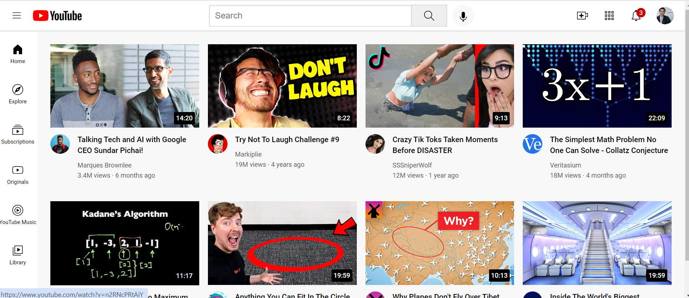

# Youtube-clone

## Description

I decided to take on the challenge to try recreate the youtube.com webpage following the html-css-course from the YouTube channel, supersimpledev. This was done to facilitate my learning in front-end-web development.

I was able to apply all the concepts learnt in css such as positioning, display, etc. 
Also, within html I was able to apply appropriate classes.

Here is the link to the deployed application: https://giorgiodavinci.github.io/Youtube-clone/

md
    
    

The above image shows the finished product of the project.

md
    

When media queries were implemented, it allowed the page to be responsive as evidenced by the image above. Media queries were implemented so the page can be viewed on different screen sizes.
## Credits

I followed the html-css-course on the YouTube channel of SuperSimpleDev. 

Here is the link to the channel video: https://youtu.be/G3e-cpL7ofc?si=iw40-eRSM9BCIWHC

And here is a link to the channel homepage: https://www.youtube.com/@SuperSimpleDev

## License

MIT